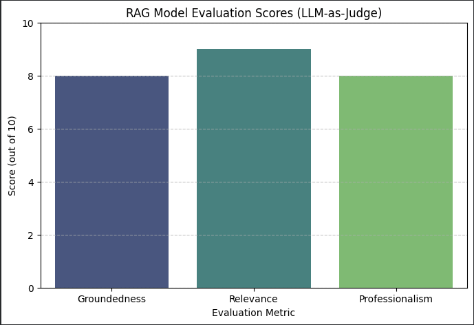

# AI Interview Prep Assistant (LangChain RAG)

A lightweight Retrieval-Augmented Generation (RAG) app that helps you prepare grounded, professional interview answers using **your resume + job description + company notes**.

**What this notebook demonstrates:**
- Document ingestion (PDF + TXT)
- Chunking + embeddings
- FAISS vector search
- Context-grounded answers with source attribution
- Clean, production-style code structure
- Gradio for PROMPTING, ask your questions in a nice UI ! 

# AI Interview Prep Assistant (LangChain RAG)

**How it works:**
1. Load documents from `/data`
  a. Upload your Resume ONLY to your /data directory. You will be prompted in the notebook to enter URLs for both Job Description + Company Notes which will automatically upload the required files into the /data directory
2. Using an OPENAI_API_KEY of your choice
3. Split → embed → store in FAISS
4. Retrieve relevant chunks
5. LLM answers using **only** the retrieved context (no hallucinations)
6. Gradio UI input your Prompts OR interact within your notebook.
   
##Sample Prompts and Output## 

🔹 Question: Why am I a strong fit for this role?
Answer:
You are a strong fit for this role due to your proactive approach to challenges, strong leadership qualities, and commitment to driving impactful results.

1. **Proactive Problem-Solving**: Your tendency to "dive in to fight the fire" resonates with the company's culture of facing challenges head-on and solving problems with grit and resilience.

2. **Ownership and Execution**: As someone who operates with maximum agency, you exemplify the qualities of a "benevolent dictator" in your domain, driving ideas with conviction and biasing toward action. This aligns with the expectation that each team member is responsible for ultimate results.

3. **Commitment to Success**: Your willingness to "run to the roar" reflects a deep care for both company and customer success, matching the organization's drive to create meaningful impact in a fast-moving environment.

**Suggestion**: Highlight specific achievements from your past experiences that illustrate these qualities to further strengthen your fit for the role.

🔹 Question: Give me a 60-second pitch for this company
Answer:
We are a company committed to building something great in a fast-paced environment, actively embracing challenges with grit and resilience. Our culture thrives on problem-solving, allowing us to dive headfirst into issues and emerge stronger, together. 

1. Our unwavering dedication to excellence is evident as we reject mediocrity and encourage rapid iterations to enhance our offerings, ensuring we remain at the forefront of innovation.
   
2. We foster a culture of open communication where 'hot takes' are not only welcomed but encouraged. This approach helps challenge the status quo and facilitates the quick identification and resolution of problems, driving continuous improvement.

3. Backed by industry recognition, our strategic focus includes cutting-edge tools like LangSmith, enabling developers to quickly debug, evaluate, and deploy solutions effectively.

I suggest emphasizing our commitment to agility and collaboration in your discussions, as these are key differentiators in our dynamic industry landscape.

🔹 Question: What gaps should I address before interviewing?
Answer:
**Direct Answer:**  
To enhance your interview readiness, focus on refining your storytelling for leadership achievements and quantifying your impact across various roles.

**Supporting Points:**  
1. **Leadership Experience:** Highlight specific instances where you aligned cross-functional teams to achieve business goals, providing clear examples of how your strategic direction contributed to successful outcomes.  
2. **Quantifiable Outcomes:** Prepare to articulate your achievements in terms of numbers, such as your experience with exceeding quotas (105–198% attainment) and how your initiatives led to revenue growth or operational efficiencies.  
3. **Ethical Leadership:** Emphasize your accomplishments in ethical leadership, which is increasingly crucial in today’s business landscape—this can differentiate you from other candidates.

**Suggestion:** Consider practicing common interview questions that focus on behavioral and situational responses to effectively convey your leadership style and the impact of your contributions.

##This includes an LLM-as-Judge evaluator with clear scores and explanation on 3 key areas: Groundedness, Relevance, and Professionalism.##

LLM-as-Judge Evaluation Results Explained
This section provides an analysis of the RAG model's performance using an LLM-as-Judge framework. This automated evaluation scores the generated answers based on predefined criteria, offering insights into the model's strengths and areas for improvement without manual human labeling.

Understanding the Metrics:
Groundedness (Score: 7/10): This metric assesses whether the generated answer relies exclusively on the provided context. A high score indicates that the LLM is not hallucinating or introducing outside information. Our model scored 7/10, suggesting a good adherence to the context but with room for more explicit evidence from the provided documents.

Relevance (Score: 9/10): This measures how directly and completely the answer addresses the user's question. A high score means the LLM understood the query and provided a pertinent response. Our model achieved 9/10, indicating strong performance in answering the question directly.

Professionalism (Score: 8/10): This evaluates the tone, structure, and business-focused nature of the answer. It checks for conciseness, clarity, and adherence to professional communication standards. Our model scored 8/10, showing a generally professional output that aligns with the intended interview prep assistant persona.

Overall Assessment (Average Score: 8/10):
The LLM-as-Judge explains: "The answer effectively demonstrates key qualities that align with the role, such as leadership, ownership, and proactive problem-solving. However, it could be made more grounded with specific examples to substantiate the claims made about skills and experiences. Overall, the tone is professional and aligns well with the company's values but could benefit from more concrete evidence of past achievements."

This summary highlights that while the responses are relevant and professional, there's a need to strengthen the connection between the general claims and concrete evidence found in the source documents.

Recommendations for Improvement:
To improve the model's performance, particularly its Groundedness, consider the following:

Enhance Source Documents: Ensure your resume, job description, and company notes contain as many specific, quantifiable examples and achievements as possible. The more detailed the input, the better the LLM can ground its answers.
Refine Chunking Strategy: Experiment with smaller CHUNK_SIZE and slightly higher CHUNK_OVERLAP (CHUNK_SIZE = 800, CHUNK_OVERLAP = 150 currently). This can help prevent crucial pieces of information (like specific numbers or project names) from being split across different chunks, ensuring they are retrieved together.
Prompt Engineering: Modify the SYSTEM_PROMPT to explicitly instruct the LLM to search for and include specific examples, metrics, or keywords from the context. For instance, you could add: "Always reference specific projects, numbers, or initiatives mentioned in the context when supporting your points."
Post-Processing/Fact-Checking: Implement an additional step where the generated answer is cross-referenced against the retrieved source chunks to verify the presence of all asserted facts. While LLM-as-Judge does this, a programmatic check could reinforce it.
